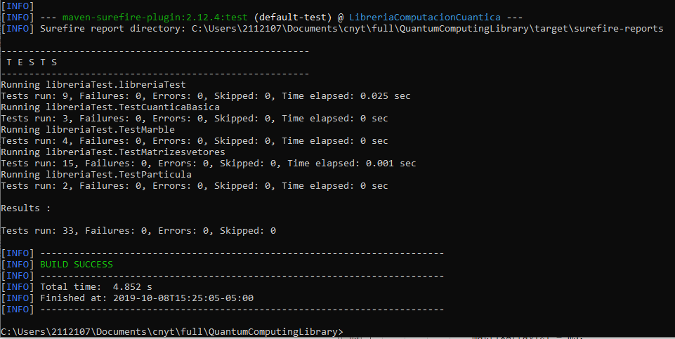

# Librería computación Cuántica: Números complejos

Este proyecto tiene la intencion de crear una especie de calculadora capaz de realizar operaciones con numeros complejos, con matrizes y vectores.

## Desarrollado por: 

* Alejandro Rodriguez del Toro

### Operaciones

las operaciones que dispone la aplicacion Para numeros complejos son:

* Suma: Suma entre  numeros complejos, como parametro entran dos complejos.
* resta: resta entre numeros complejos, como parametro entran dos complejos.
* Producto: multiplicacion entre complejos, como parametro entran dos complejos.
* Division: Division entre complejos , como parametro entran dos complejos.
* Modulo: modulo del complejo, como parametro entra un complejo y es un numero entero su salida.
* Conjugado: Conjugacion del complejo,como parametro entra un complejo.
* aPolar: Este metodo permite dado un numero complejo, transformarlo a un numero polar.
* aCartesiano: Contratio aPolar, este metodo recibe un numero Polar y lo convierte en un numero complejo.
* Fase: Fase del complejo, recibe un NUmero complejo y retorna la representacion del radio de este.

-----------
 #### Operaciones Vectores y Matrizes
las operaciones disponibles para hacer calculos con las matrizes y vectores son:

* sumaVectorial: coje dos vectores y los suma.
* inversaVectorial: calcula el inverso de una vector.
* multiplicacionEscalarVectorial: multiplica un numero por un vector.
* sumaMatriz: dadas dos matrizes de n*m, retorna la matriz n*m correspondiente a la suma de ambas.
* inversaMatriz: dada una matriz, calcula su inversa.
* multiplicacionEscalarMatriz: dado un escalar, es multiplicado por una matriz y retorna la matriz resultante.
* Transpuesta: dada un matriz, calcula su traspuesta.
* MatrizConjugada: dada una matriz, calcula el conjugado de cada uno de sus elemntos.
* MatrizAdjunta: dada una matriz, calcula su adjuta(trasnpuesta y conjugada).
* NormaMatriz: dada una matriz, calcula la norma de esta.
* DistanciaMatrizes: recibe dos matrizes, y calcula la distancia entre ambas.
* EsMatrizUnitaria: Dada una matriz, calcula si esta es unitaria, retorna verdadero o falso.
* isHermitianMatriz: dada una matriz, calcula si esta matriz es hermitiana.
* Producto tensor: Dadas dos matries, realiza la operacion del productor tensor en ellas, retorna el resultado de esta operacion;

### Testing

Se crearon 9 pruebas, una por cada metodo y la prueba madre i*i, para ejecutarlas use mvn.

Para vectores y matrizes se crearon 15 pruebas, cada una por funcion.

**Descarga**
```
$ git clone https://github.com/alejandrordto/QuantumComputingLibrary
```
**Entra a la Capeta**
```
$ cd QuantumComputingLibrary
```

**Compila**
```
$ mvn clean compile
```
**Packing**
```
$ mvn package
```
**tests**
```
$ mvn test
```


# Uso del codigo

**Importar Librerias**

```
import eci.escuelaing.libreriacomputacioncuantica.libreriacomputacion.LibreriaComputacion;
import eci.escuelaing.libreriacomputacioncuantica.libreriacomputacion.NumeroComplejo;
import eci.escuelaing.libreriacomputacioncuantica.libreriacomputacion.NumeroPolar;
```
**Crea la el objeto  LibreriaComputacion**

```
 LibreriaComputacion app = new LibreriaComputacion();
```

**Ya puedes usar los metodos**

```
NumeroComplejo nc1 = new NumeroComplejo(6,5);
NumeroComplejo nc2 = new NumeroComplejo(1,-5);
NumeroComplejo respuesta = app.suma(nc1, nc2);
```

# License
This project is under the Apache license - see [LICENSE](LICENSE.txt) for more details.
